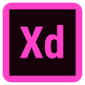

<h1 align="center">𝙷𝚒 , 𝙸'𝚖 𝙹𝚊𝚗</h1>

 

<h3 align="center">Aspiring Full Stack Web Developer with QA Manual and Automation Tester experience</h3>

 

 𝙸’𝚖 𝚌𝚞𝚛𝚛𝚎𝚗𝚝𝚕𝚢 𝚕𝚎𝚊𝚛𝚗𝚒𝚗𝚐 TypeScript, React, Next.js, Express

 𝙰𝚕𝚕 𝚘𝚏 𝚖𝚢 𝚙𝚛𝚘𝚓𝚎𝚌𝚝𝚜 𝚊𝚛𝚎 𝚊𝚟𝚊𝚒𝚕𝚊𝚋𝚕𝚎 𝚊𝚝 <a href="https://janchrzan-portfolio.netlify.app">my portfolio</a>

 𝙰𝚜𝚔 𝚖𝚎 𝚊𝚋𝚘𝚞𝚝 webDev, tech, gym, music, movies, games

 𝚈𝚘𝚞 𝚌𝚊𝚗 𝚛𝚎𝚊𝚌𝚑 𝚖𝚎 𝚋𝚢 𝚎𝚖𝚊𝚒𝚕𝚒𝚗𝚐 <a href="mailto:jan.chrzan@icloud.com">my address</a>

 

<h2 align="center">𝚂𝚃𝙰𝚃𝚂</h2>

  
  

 

<h2 align="center">𝚂𝚃𝙰𝙲𝙺</h2>
<h3 align="center">𝙵𝚁𝙾𝙽𝚃-𝙴𝙽𝙳</h3>

    
    
    
    
    
    
    
    

 

<h3 align="center">𝙱𝙰𝙲𝙺-𝙴𝙽𝙳</h3>

    
    
    
    
    
    
      
      
    

 

<h3 align="center">𝚃𝙾𝙾𝙻𝚂</h3>

    
    
    
    
    
    
    
    
    
    
    

 

<h3 align="center">𝙳𝙴𝚂𝙸𝙶𝙽</h3>

    
    
    
    

#